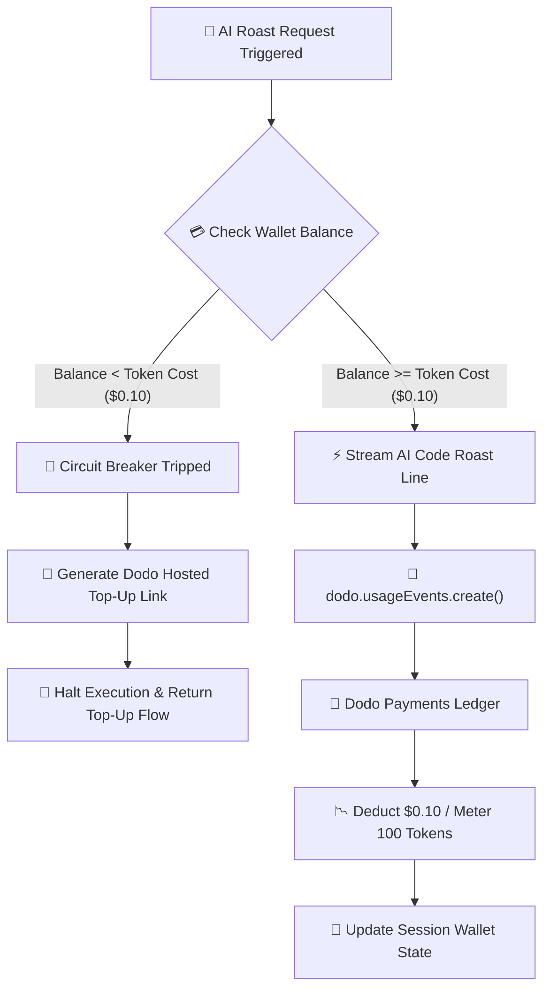

# Dodo Roaster

> **An event-driven AI Code Roast Bot demonstrating real-time pay-per-token metered billing and circuit-breaker wallet enforcement using the `dodopayments` SDK.**

`dodo-roaster` solves the fundamental margin-collapse problem faced by modern AI wrapper applications. Instead of locking heavy LLM users into flat-rate monthly subscriptions that drain OpenAI/Anthropic API keys, `dodo-roaster` meters token consumption on a per-event basis, tracks user credit balances in real time, and automatically triggers hosted top-up checkout flows when balance thresholds are breached.

---

## 📌 Architectural Overview

When an execution request hits the AI roasting pipeline, `dodo-roaster` initiates a synchronous event metering loop:



---

## 🎯 The Engineering Problem & Dodo's Solution

| The Subscription Traps | How `dodo-roaster` + Dodo Payments Solves It |
| --- | --- |
| **Margin Erosion:** Power users running $400 in LLM API requests on a $19/mo flat plan. | **Real-Time Metering:** `dodo.usageEvents.create()` tracks exact token counts and charges per event. |
| **Complex Database Ledgering:** Building custom SQL aggregation models and race-condition sync logic. | **Merchant-of-Record (MoR) Ledger:** Offloads wallet tracking, tax calculation, and fraud checks to Dodo. |
| **Global Tax & Compliance:** Handling regional VAT/GST across 190+ countries for micro-top-ups. | **Hosted Top-Up Flows:** Native MoR handling for localized foreign currency conversion and VAT. |

---

## 💡 Key Engineering Features

* **Real-Time Event Dispatching:** Synchronous integration with the official `dodopayments` TypeScript SDK to track granular consumption vectors (`llm_roast_tokens`).
* **Circuit-Breaker Execution Halting:** Inline state validation preventing downstream LLM execution when credit balances fall below structural execution unit costs ($0.10).
* **Merchant-of-Record Handshake:** Automatic delegation of billing, foreign exchange, and tax compliance to Dodo's hosted infrastructure upon wallet depletion.
* **Resilient SDK Error Interception:** Local fallback logging matrix ensuring execution continuity during initial sandbox testing without pre-configured dashboard meters.

---

## 📂 Repository Structure

```text
dodo-roaster/
├── demo.ts             # Primary entry point & metered billing simulation loop
├── .env                # Local secrets configuration (DODO_PAYMENTS_API_KEY)
├── .env.example        # Environment variable template
├── package.json        # Node.js dependencies & execution scripts
└── tsconfig.json       # Strict TypeScript compiler configurations

```

---

## 🛠️ Tech Stack

* **Runtime Framework:** Node.js (v18+)
* **Language Compilers:** TypeScript (`tsx` execution engine)
* **Payments & Metering Infrastructure:** `dodopayments` Official Node.js SDK
* **Environment Configuration:** `dotenv`

---

## ⚙️ Running Locally

### 1. Clone & Install Dependencies

```bash
# Clone the repository
git clone https://github.com/your-username/dodo-roaster.git
cd dodo-roaster

# Install dependencies
npm install

```

### 2. Configure Environment Secrets

Create a `.env` file in the root directory:

```env
# Dodo Payments API Key (Test Mode)
DODO_PAYMENTS_API_KEY=dodo_test_your_api_key_here

```

### 3. Execute the Metered Billing Simulation

Run the TypeScript entry point directly:

```bash
npx tsx demo.ts

```

---

## 📺 Execution Output Sample

```text
====================================================
  🔥 DODO PAYMENTS METERED BILLING DEMO
  🤖 Feature: AI Code Roast Bot (Pay-Per-Token)
====================================================

Starting session for Customer [cust_test_hyderabad_dev]...
Current Dodo Wallet Balance: $0.25

   [Dodo SDK Event Dispatched] -> event_name: "llm_roast_tokens"
🤖 AI Roast #1: "Line 1: Why are you using nested loops here? My CPU started crying."
   └─ [Dodo SDK] Metered 100 tokens ($0.10 deducted) | Wallet Balance: $0.15

   [Dodo SDK Event Dispatched] -> event_name: "llm_roast_tokens"
🤖 AI Roast #2: "Line 4: This variable naming style violates the Geneva Convention."
   └─ [Dodo SDK] Metered 100 tokens ($0.10 deducted) | Wallet Balance: $0.05


❌ [DODO METER ALERT] Balance exhausted!
   Remaining Balance: $0.05
   AI Bot Halted: "Top up $1.00 via Dodo to hear the rest of my roast!"
   🔗 Live Checkout Link: https://checkout.dodopayments.com/buy/prd_test_123

====================================================

```

---

## 📜 License

Distributed under the **MIT License**. Built for the **Dodo Payments DevRel Take-Home Assignment**.